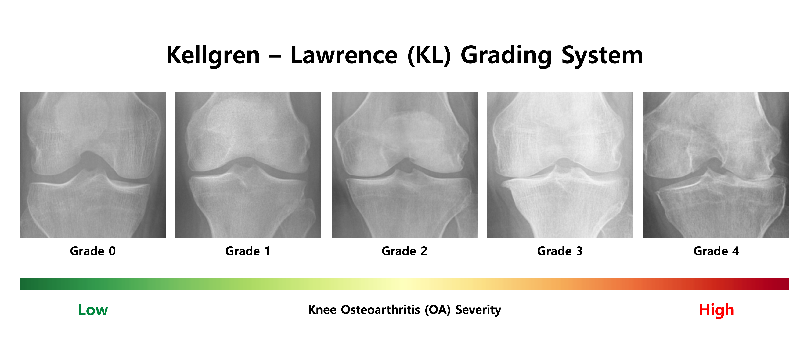

# Ensemble deep‐learning networks for automated osteoarthritis grading in knee X‐ray images

## Overview
This repository contains the code and resources for the paper ["Ensemble deep‐learning networks for automated osteoarthritis grading in knee X‐ray images"](https://www.nature.com/articles/s41598-023-50210-4). The aim of this project is to develop an ensemble network that predicts the Kellgren-Lawrence (KL) grade for knee osteoarthritis (OA) severity using a deep learning approach.



## Introduction
Osteoarthritis (OA) is a common joint disease that affects millions of people worldwide. The Kellgren-Lawrence (KL) grading system is the standard for classifying the severity of knee OA using X-ray images. However, the grading depends on the clinician’s subjective assessment, leading to significant variability. This project proposes an ensemble deep learning model that provides consistent and accurate KL grade predictions.

## Dataset
The dataset used in this study is from the Osteoarthritis Initiative (OAI), which consists of 8260 knee X-ray images. The dataset includes images for KL grades ranging from 0 to 4. It is publicly available and can be accessed [here](https://data.mendeley.com/datasets/56rmx5bjcr/1).

## Installation
## Usage
### Training

### Evaluation

### Testing

## Model Architecture
The ensemble network consists of several deep learning models, including:
- DenseNet-161
- EfficientNet-b5
- EfficientNet-V2-s
- RegNet-Y-8GF
- ResNet-101
- ResNext-50-32x4d
- Wide-ResNet-50-2
- ShuffleNet-V2-x2-0

Each model is trained with optimal image sizes to enhance performance. The final prediction is made using a mix voting method, which combines hard and soft voting strategies.


## Training Strategy
The training process involves the following steps:
1. Models are trained using different image sizes.
2. The initial layers are frozen, and only the fully connected layers are trained with a learning rate of 0.01.
3. Subsequently, all layers are unfrozen, and the learning rate is reduced progressively to stabilize training.
4. Stratified five-fold cross-validation is used to handle class imbalance and improve generalization.

## Results
The proposed ensemble network achieved:
- Accuracy: 76.93%
- F1 Score: 0.7665

These results outperform existing techniques in KL grade classification. Detailed experimental results and performance metrics are provided in the [paper](https://www.nature.com/articles/s41598-023-50210-4).

## Visualization
Grad-CAM visualization is used to understand the focus areas of the model. The visualization helps in verifying that the model correctly identifies key features related to KL grading, such as joint space narrowing and osteophyte formation.


## Citation
```
Chen, Pingjun (2018), “Knee Osteoarthritis Severity Grading Dataset”, Mendeley Data, V1, doi: 10.17632/56rmx5bjcr.1
```

## License
This project is released under the [MIT License](LICENSE).
